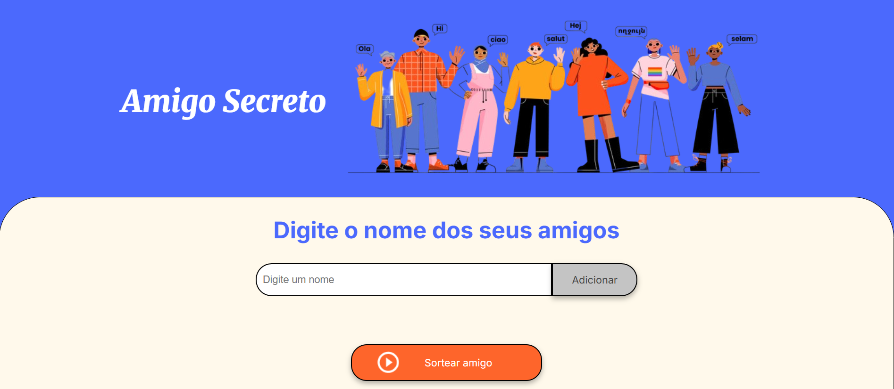

<h1 align="center">Jogo Amigo Secreto! 🕹️🔍</h1>

  O Jogo Amigo Secreto é uma aplicação totalmente interativa e dinâmica onde você pode adicionar ou remover amigos e sortear quem vai ser o seu Amigo Secreto!

  <a href="#-tecnologias">🛠 Tecnologias</a>&nbsp;&nbsp;&nbsp;|&nbsp;&nbsp;&nbsp;
  <a href="#-projeto">💻 Projeto</a>&nbsp;&nbsp;&nbsp;|&nbsp;&nbsp;&nbsp;

  

  <i>Sinta-se à vontade e divirta-se testando suas habilidades para advinhar quem é o amigo secreto! 🔍</i>

## 🛠 Tecnologias

Este projeto foi desenvolvido com as seguintes tecnologias:  

📚 HTML  
🎨 CSS  
📜 JavaScript  

## 💻 Projeto

Este projeto é uma aplicação web simples para organizar e sortear amigos secretos. Ele permite que os usuários adicionem nomes de amigos à lista e realizem um sorteio aleatório.

💡 Principais funcionalidades:
1. Adicionar os nomes dos participantes no campo de texto.
2. Sortear de forma aleatória os nomes escolhidos.
3. Exibir o resultado sorteado na tela.
4. Interface limpa e dinâmica.
&nbsp;  
&nbsp;

## 🖱️ Acesse o Projeto

Você pode acessar o projeto online clicando no link abaixo:

🕹️ [Jogo Amigo Secreto](https://github.com/vitorgusmao-dev/challeng-amigo-secreto/)
&nbsp;  
&nbsp;  
 
# ✏️ Autor

| [ Suiane Henrichs](https://github.com/vitorgusmao-dev) |
| :---: |

